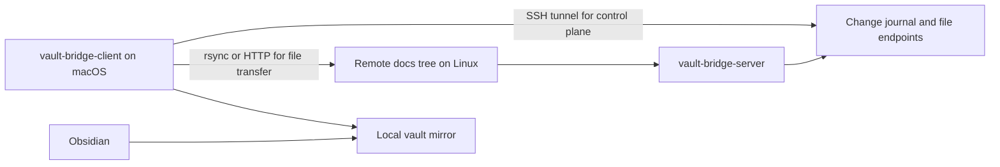

<div align="center">

# vault-bridge

> Sync remote docs to a local vault, then read them in Obsidian.

[](https://go.dev/)
[](#)
[](./LICENSE)

[Chinese](./README_zh.md) · [macOS foreground guide](./docs/macos-foreground-client-guide.md)

</div>

---

`vault-bridge` is a Go client/server sync tool for one specific workflow:

- keep docs on a remote Linux machine
- sync them to a local macOS directory
- open that local directory as an Obsidian vault

The source of truth stays remote. Reading happens locally.

## Why It Exists

A common docs workflow looks like this:

- notes, markdown, images, and PDFs live on a Linux host
- the Linux host is reachable through SSH, but not through a directly exposed web port
- you want a local mirror on macOS for fast browsing, search, backlinks, and graph view in Obsidian

`vault-bridge` turns that into a continuous sync loop instead of a manual copy step.

## How It Works



## What It Does

| Component | Role |
| --- | --- |
| `vault-bridge-server` | Watches the remote docs tree, stores a file snapshot and append-only event log, serves HTTP endpoints |
| `vault-bridge-client` | Pulls incremental updates, maintains a local cursor, deletes removed files, fetches changed files |
| `rsync` | Preferred file transfer path for changed files |
| HTTP fallback | Used when `rsync` is unavailable or fails |
| SSH tunnel | Lets the client reach the server control plane when the remote HTTP port is not directly accessible |

## Quick Start

Build:

```bash
go build ./...
```

Start the server on the Linux host:

```bash
./bin/vault-bridge-server \
  -addr :39090 \
  -root /srv/vault-bridge/source \
  -state-dir "$HOME/.local/state/vault-bridge/server" \
  -filter-config ./config/filter.json
```

Start the client on macOS in foreground stream mode:

```bash
./bin/vault-bridge-client \
  -stream \
  -server http://127.0.0.1 \
  -tunnel-host server-host \
  -tunnel-remote-port 39090 \
  -local-root "$HOME/Documents/vault-bridge" \
  -state-dir "$HOME/Library/Application Support/vault-bridge" \
  -sync-mode auto \
  -rsync-source server-host:/srv/vault-bridge/source/ \
  -rsync-bin /opt/homebrew/bin/rsync
```

Then open the local mirror in Obsidian:

```text
$HOME/Documents/vault-bridge
```

## Typical Obsidian Workflow

1. Start `vault-bridge-client` in foreground stream mode.
2. Wait for the first sync to finish.
3. Open the local mirror directory in Obsidian.
4. Read, search, and navigate the docs locally.
5. Stop the client with `Ctrl+C` when live updates are no longer needed.

The local mirror behaves like a normal Obsidian vault. `vault-bridge` only keeps it current.

## Features

- incremental journal with persistent cursor
- `inotify` plus periodic reconcile on the server
- one-shot sync and long-lived stream mode on the client
- `rsync --files-from` as the preferred data path
- HTTP fallback when `rsync` is unavailable or failing
- built-in SSH tunnel for the HTTP control plane
- configurable filter rules through `config/filter.json`

## Configuration

Server-side filter rules live in `config/filter.json`.

Default behavior:

- exclude `.git/`
- exclude `.obsidian/`
- exclude `.DS_Store`
- include `.md`, `.png`, `.jpg`, `.jpeg`, `.gif`, `.webp`, `.svg`, `.pdf`, `.canvas`
- optionally exclude whole path subtrees or glob-style path patterns with `excluded_path_patterns`

Pattern notes:

- a plain path like `mint/issues/issue432/02_live_validation` excludes that subtree
- `**` matches across directory boundaries
- `*` and `?` match within a single path segment
- useful for pruning high-churn, non-sync content such as experiment outputs or local virtualenvs

Transfer modes:

| Mode | Behavior |
| --- | --- |
| `auto` | Try `rsync` first, then fall back to HTTP |
| `rsync` | Require `rsync` |
| `http` | Force HTTP file fetch |

Tunnel flags:

- `-tunnel-host`: SSH host that exposes the remote server port
- `-tunnel-remote-host`: remote target host seen from the SSH server; defaults to the host part of `-server`
- `-tunnel-remote-port`: remote target port; defaults to the port part of `-server`
- `-tunnel-local-port`: local forwarded port; `0` means auto-pick a free port above `30000`
- default server listen port: `39090`

## Repository Layout

- `cmd/vault-bridge-server/`: Linux server entrypoint
- `cmd/vault-bridge-client/`: macOS client entrypoint
- `internal/bridge/`: filter, journal store, reconcile, watcher
- `internal/protocol/`: shared wire types
- `config/`: default filter config
- `scripts/`: runnable wrappers for server and client
- `deploy/`: example service definitions for supervisor, `systemd`, and launchd
- `docs/`: operator notes and environment-specific guides

## Deployment Files

- Linux server: `deploy/supervisor/vault-bridge-server.conf`
- Linux user service: `deploy/systemd/user/vault-bridge-server.service`
- macOS client: `deploy/launchd/dev.vault-bridge.client.plist`

For foreground macOS usage, see:

- `docs/macos-foreground-client-guide.md`
