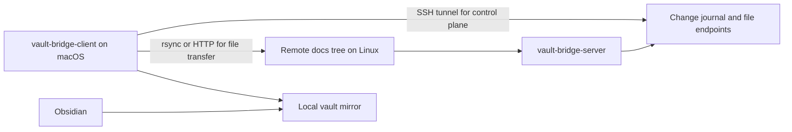

# vault-bridge

Go client/server sync for mirroring a remote document tree into a local vault.

Chinese version: [README_zh.md](README_zh.md)

## Overview

`vault-bridge` solves one specific workflow: keep documentation on a remote Linux machine, sync it to a local macOS vault, then browse and search it with Obsidian.

Current project scope:

- server on Linux
- client on macOS
- one-way sync from server to client
- markdown and common vault assets
- operator-friendly deployment with plain binaries and shell wrappers

## Primary Use Case

Typical flow:

1. docs live on a remote Linux host
2. `vault-bridge-server` watches that remote docs tree
3. `vault-bridge-client` pulls incremental updates to a local directory
4. Obsidian opens that local directory as a vault

This makes the remote docs tree readable locally without moving the source of truth.

## How It Works



## Features

- incremental journal with persistent cursor
- `inotify` plus periodic reconcile on the server
- one-shot sync and long-lived stream mode on the client
- `rsync --files-from` as the preferred data path
- HTTP fallback when `rsync` is unavailable or failing
- built-in SSH tunnel for the HTTP control plane when the server port is not directly reachable
- configurable filter rules through `config/filter.json`

## Repository Layout

- `cmd/vault-bridge-server/`: Linux server entrypoint
- `cmd/vault-bridge-client/`: macOS client entrypoint
- `internal/bridge/`: filter, journal store, reconcile, watcher
- `internal/protocol/`: shared wire types
- `config/`: default filter config
- `scripts/`: runnable wrappers for server and client
- `deploy/`: example service definitions for supervisor, `systemd`, and launchd
- `docs/`: operator notes and environment-specific guides

## Quick Start

Build:

```bash
go build ./...
```

Start the server on the Linux host:

```bash
./bin/vault-bridge-server \
  -addr :39090 \
  -root /srv/vault-bridge/source \
  -state-dir "$HOME/.local/state/vault-bridge/server" \
  -filter-config ./config/filter.json
```

Start the macOS client in foreground stream mode:

```bash
./bin/vault-bridge-client \
  -stream \
  -server http://127.0.0.1 \
  -tunnel-host server-host \
  -tunnel-remote-port 39090 \
  -local-root "$HOME/Documents/vault-bridge" \
  -state-dir "$HOME/Library/Application Support/vault-bridge" \
  -sync-mode auto \
  -rsync-source server-host:/srv/vault-bridge/source/ \
  -rsync-bin /opt/homebrew/bin/rsync
```

Open the local directory in Obsidian after the first sync:

```text
$HOME/Documents/vault-bridge
```

## Use It With Obsidian

Once the client is running, the local mirror behaves like a normal Obsidian vault.

Recommended workflow:

1. run `vault-bridge-client` in foreground stream mode
2. wait for the first sync to finish
3. open the local mirror directory in Obsidian
4. keep the client running while you read the docs
5. stop the client with `Ctrl+C` when you no longer need live updates

If you want a shell shortcut, add an alias that starts the client with your actual server host, vault path, and `rsync` settings.

## Configuration

Server-side filter rules live in `config/filter.json`.

Default behavior matches the previous Python implementation:

- exclude `.git/`
- exclude `.obsidian/`
- exclude `.DS_Store`
- include `.md`, `.png`, `.jpg`, `.jpeg`, `.gif`, `.webp`, `.svg`, `.pdf`, `.canvas`

Transfer modes:

- `auto`: try `rsync` first, then fall back to HTTP
- `rsync`: require `rsync`
- `http`: force HTTP file fetch

Tunnel flags:

- `-tunnel-host`: SSH host that exposes the remote server port
- `-tunnel-remote-host`: remote target host seen from the SSH server; defaults to the host part of `-server`
- `-tunnel-remote-port`: remote target port; defaults to the port part of `-server`
- `-tunnel-local-port`: local forwarded port; `0` means auto-pick a free port above `30000`
- server default listen port: `39090`

## Deployment

This repository includes example deployment files:

- Linux server: `deploy/supervisor/vault-bridge-server.conf`
- Linux user service: `deploy/systemd/user/vault-bridge-server.service`
- macOS client: `deploy/launchd/dev.vault-bridge.client.plist`

Foreground terminal usage on macOS is documented here:

- `docs/macos-foreground-client-guide.md`
