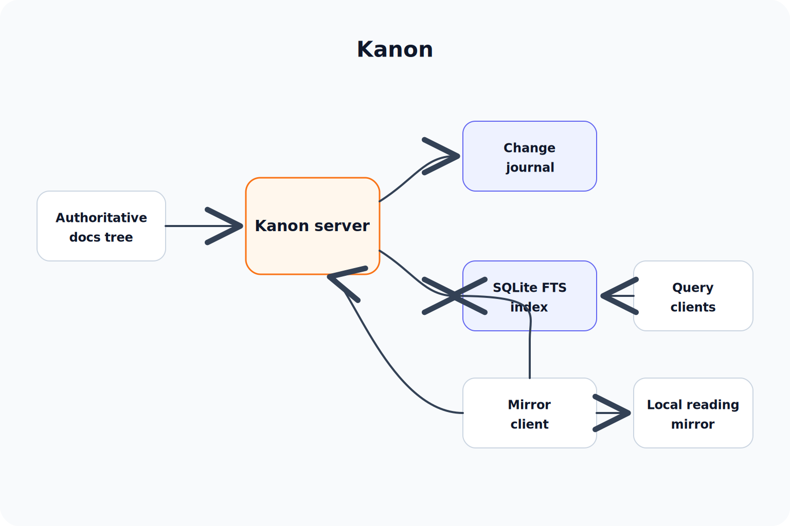

<div align="center">

# Kanon

> Path-first search and local mirroring for a docs workspace.

[](https://go.dev/)
[](#)
[](./LICENSE)

[Chinese](./README_zh.md) · [macOS foreground guide](./docs/macos-foreground-client-guide.md) · [Linux supervisord deploy guide](./docs/linux-supervisord-deploy-guide.md)

</div>

---

Kanon is the location layer for a docs workspace.

It watches an authoritative Linux docs tree, maintains an incremental journal, builds a SQLite FTS index, answers query requests with document paths, and mirrors changed files to local reading directories. It does not generate answers and does not govern how docs should be written.

## Design stance

Kanon optimizes for path discovery:

- return document locations, not synthesized content
- rank path, filename, title, and heading signals above body text
- keep mirror sync as a first-class capability for human reading workflows
- record query logs so retrieval behavior can be evaluated from real callers
- keep the live index outside the watched tree so indexing does not trigger the watcher

## How it works




## Components

| Component | Role |
| --- | --- |
| `kanon-server` | Watches a docs tree, stores a file snapshot and event journal, builds the index, serves HTTP APIs |
| `kanon-client` | Mirrors changed files to a local directory and keeps a persistent cursor |
| `kanon-bench` | Runs path-recall and ranking benchmarks against a live Kanon server |
| SQLite FTS | Live lexical index with Chinese token expansion and deterministic path-first reranking |
| Query log | JSONL record of query text, parameters, result paths, scores, and caller headers |

## HTTP APIs

| Endpoint | Purpose |
| --- | --- |
| `GET /healthz` | server and watcher health |
| `GET /v1/index/health` | index health, seq lag, document count |
| `POST /v1/query` | path-first search over indexed docs |
| `GET /v1/snapshot` | file snapshot for mirror clients |
| `GET /v1/changes` | incremental event stream window |
| `GET /v1/stream` | long-lived change stream |
| `GET /v1/archive` | tar archive transfer for changed paths |
| `GET /v1/file` | single-file transfer fallback |

Query example:

```bash
curl -sS -X POST http://127.0.0.1:39090/v1/query \
  -H 'content-type: application/json' \
  -d '{"query":"kanon architecture","limit":5}'
```

## Build

```bash
go test ./...
go build -o bin/kanon-server ./cmd/kanon-server
go build -o bin/kanon-client ./cmd/kanon-client
go build -o bin/kanon-bench ./cmd/kanon-bench
```

`CGO_ENABLED=1` uses jieba for Chinese tokenization. `CGO_ENABLED=0` builds without jieba and uses the Go gse fallback.

## Server quick start

```bash
./bin/kanon-server \
  -addr :39090 \
  -root /path/to/docs \
  -state-dir "$HOME/.local/state/kanon/server" \
  -filter-config ./config/filter.json
```

Important server files:

```text
<state-dir>/events.jsonl
<state-dir>/snapshot.json
<state-dir>/index.sqlite
<state-dir>/queries.jsonl
```

## macOS mirror quick start

```bash
./bin/kanon-client \
  -stream \
  -server http://127.0.0.1 \
  -tunnel-host ssh-alias \
  -tunnel-remote-port 39090 \
  -local-root "$HOME/Documents/docs-mirror" \
  -state-dir "$HOME/Library/Application Support/kanon" \
  -sync-mode auto \
  -rsync-source ssh-alias:/path/to/docs/ \
  -rsync-bin /opt/homebrew/bin/rsync
```

Transfer modes:

| Mode | Behavior |
| --- | --- |
| `auto` | Try `rsync` first, then fall back to HTTP archive transfer |
| `archive` | Force HTTP archive transfer |
| `rsync` | Require `rsync` |
| `http` | Force one-file-at-a-time HTTP transfer |

## Benchmark

```bash
go run ./cmd/kanon-bench \
  -server http://127.0.0.1:39090 \
  -cases testdata/docs-recall-cases.json \
  -limit 10 \
  -fail-on-case
```

The benchmark checks recall, top1, MRR, max-rank assertions, and negative-path ordering.

## Repository layout

- `cmd/kanon-server/`: Linux server entrypoint
- `cmd/kanon-client/`: mirror client entrypoint
- `cmd/kanon-bench/`: live-server recall benchmark
- `internal/core/`: filter, journal store, reconcile, watcher
- `internal/index/`: SQLite index, tokenizer, query, reranking
- `internal/benchmark/`: benchmark evaluator
- `internal/protocol/`: shared wire types
- `config/`: default filter config
- `scripts/`: server/client run scripts
- `deploy/`: supervisor, `systemd`, and launchd examples
- `docs/`: operator guides

## Deployment files

- Linux server: `deploy/supervisor/kanon-server.conf`
- Linux user service: `deploy/systemd/user/kanon-server.service`
- macOS client: `deploy/launchd/dev.kanon.client.plist`

For Linux hosts that run `kanon-server` under `supervisord`, see `docs/linux-supervisord-deploy-guide.md`.

For foreground macOS usage, see `docs/macos-foreground-client-guide.md`.
