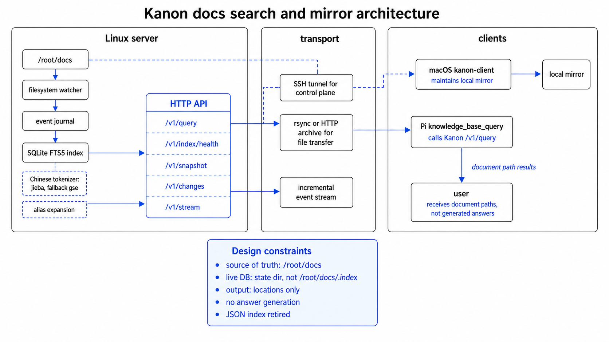

<div align="center">

# Kanon

> 面向 docs workspace 的路径优先搜索和本地镜像。

[](https://go.dev/)
[](#)
[](./LICENSE)

[English](./README.md) · [macOS 前台运行指南](./docs/macos-foreground-client-guide.md) · [Linux supervisord 部署指南](./docs/linux-supervisord-deploy-guide.md)


</div>

---

Kanon 是 docs workspace 的位置层。

它监听 Linux 上的权威 docs 树，维护增量日志，构建 SQLite FTS 索引，查询时返回文档路径，并把变更文件同步到本地阅读目录。它不生成答案，也不规定 docs 应该如何书写。

## 设计立场

Kanon 优化的是路径发现：

- 返回文档位置，不生成内容
- path、filename、title、heading 信号高于 body 文本
- 本地镜像是人类阅读工作流的核心能力
- 记录 query log，用真实调用分析检索行为
- live index 放在被监听目录外，避免索引写入触发 watcher

## 工作方式



## 组件

| 组件 | 作用 |
| --- | --- |
| `kanon-server` | 监听 docs 树，维护文件快照和事件日志，构建索引，提供 HTTP API |
| `kanon-client` | 同步变更文件到本地目录，并维护持久化 cursor |
| `kanon-bench` | 针对 live Kanon server 跑路径召回和排序 benchmark |
| SQLite FTS | live 词法索引，包含中文 token expansion 和确定性的路径优先重排 |
| Query log | JSONL 记录 query、参数、结果路径、分数和调用方 headers |

## HTTP API

| Endpoint | 用途 |
| --- | --- |
| `GET /healthz` | server 和 watcher 健康状态 |
| `GET /v1/index/health` | index 健康状态、seq lag、文档数量 |
| `POST /v1/query` | 对 indexed docs 做路径优先搜索 |
| `GET /v1/snapshot` | mirror client 使用的文件快照 |
| `GET /v1/changes` | 增量事件窗口 |
| `GET /v1/stream` | 长连接变更流 |
| `GET /v1/archive` | changed paths 的 tar archive 传输 |
| `GET /v1/file` | 单文件传输 fallback |

查询例子：

```bash
curl -sS -X POST http://127.0.0.1:39090/v1/query \
  -H 'content-type: application/json' \
  -d '{"query":"kanon architecture","limit":5}'
```

## 构建

```bash
go test ./...
go build -o bin/kanon-server ./cmd/kanon-server
go build -o bin/kanon-client ./cmd/kanon-client
go build -o bin/kanon-bench ./cmd/kanon-bench
```

`CGO_ENABLED=1` 使用 jieba 做中文分词。`CGO_ENABLED=0` 不编译 jieba，使用 Go gse fallback。

## Server 快速启动

```bash
./bin/kanon-server \
  -addr :39090 \
  -root /path/to/docs \
  -state-dir "$HOME/.local/state/kanon/server" \
  -filter-config ./config/filter.json
```

重要 server 文件：

```text
<state-dir>/events.jsonl
<state-dir>/snapshot.json
<state-dir>/index.sqlite
<state-dir>/queries.jsonl
```

## macOS 镜像快速启动

```bash
./bin/kanon-client \
  -stream \
  -server http://127.0.0.1 \
  -tunnel-host ssh-alias \
  -tunnel-remote-port 39090 \
  -local-root "$HOME/Documents/docs-mirror" \
  -state-dir "$HOME/Library/Application Support/kanon" \
  -sync-mode auto \
  -rsync-source ssh-alias:/path/to/docs/ \
  -rsync-bin /opt/homebrew/bin/rsync
```

传输模式：

| 模式 | 行为 |
| --- | --- |
| `auto` | 先尝试 `rsync`，失败后回退到 HTTP archive |
| `archive` | 强制使用 HTTP archive |
| `rsync` | 强制要求 `rsync` |
| `http` | 强制逐文件 HTTP 拉取 |

## Benchmark

```bash
go run ./cmd/kanon-bench \
  -server http://127.0.0.1:39090 \
  -cases testdata/docs-recall-cases.json \
  -limit 10 \
  -fail-on-case
```

Benchmark 检查 recall、top1、MRR、max-rank 断言和 negative-path 排序。

## 仓库结构

- `cmd/kanon-server/`: Linux server 入口
- `cmd/kanon-client/`: mirror client 入口
- `cmd/kanon-bench/`: live-server recall benchmark
- `internal/core/`: filter、journal store、reconcile、watcher
- `internal/index/`: SQLite index、tokenizer、query、reranking
- `internal/benchmark/`: benchmark evaluator
- `internal/protocol/`: 共享协议结构
- `config/`: 默认过滤配置
- `scripts/`: server/client 运行脚本
- `deploy/`: supervisor、`systemd`、launchd 示例
- `docs/`: 运维指南

## 部署文件

- Linux server: `deploy/supervisor/kanon-server.conf`
- Linux user service: `deploy/systemd/user/kanon-server.service`
- macOS client: `deploy/launchd/dev.kanon.client.plist`

Linux host 使用 `supervisord` 托管 `kanon-server` 时，见 `docs/linux-supervisord-deploy-guide.md`。

macOS 前台运行方式见 `docs/macos-foreground-client-guide.md`。
