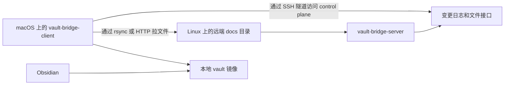

<div align="center">

# vault-bridge

> 把远端 docs 同步到本地 vault，然后用 Obsidian 打开看。

[](https://go.dev/)
[](#)
[](./LICENSE)

[English](./README.md) · [macOS 前台运行指南](./docs/macos-foreground-client-guide.md) · [Linux supervisord 部署指南](./docs/linux-supervisord-deploy-guide.md)

</div>

---

`vault-bridge` 是一个用 Go 实现的 C/S 文档同步工具，解决的是一个很具体的工作流：

- docs 保存在远端 Linux 机器上
- 同步到本地 macOS 目录
- 再把这个本地目录作为 Obsidian vault 打开

source of truth 保持在远端，阅读发生在本地。

## 为什么需要它

很多文档工作流其实是这样的：

- 笔记、markdown、图片、PDF 放在 Linux 主机上
- Linux 主机可以通过 SSH 连进去，但不会直接暴露 HTTP 端口
- 你希望在 macOS 上有一个本地镜像，用 Obsidian 做搜索、双链、图谱和浏览

`vault-bridge` 把这件事从手工复制变成持续同步。

## 工作方式



## 它做什么

| 组件 | 作用 |
| --- | --- |
| `vault-bridge-server` | 监控远端 docs 目录，维护文件快照和追加式事件日志，并暴露 HTTP 接口 |
| `vault-bridge-client` | 拉取增量更新，维护本地 cursor，删除失效文件，拉取变更文件 |
| `rsync` | 变更文件的优先传输路径 |
| HTTP fallback | `rsync` 不可用或失败时的回退路径 |
| SSH tunnel | 当远端 HTTP 端口不能直连时，让 client 仍然能访问 control plane |

## 快速开始

构建：

```bash
go build ./...
```

在 Linux 主机上启动 server：

```bash
./bin/vault-bridge-server \
  -addr :39090 \
  -root /srv/vault-bridge/source \
  -state-dir "$HOME/.local/state/vault-bridge/server" \
  -filter-config ./config/filter.json
```

在 macOS 上以前台 stream 模式启动 client：

```bash
./bin/vault-bridge-client \
  -stream \
  -server http://127.0.0.1 \
  -tunnel-host server-host \
  -tunnel-remote-port 39090 \
  -local-root "$HOME/Documents/vault-bridge" \
  -state-dir "$HOME/Library/Application Support/vault-bridge" \
  -sync-mode auto \
  -rsync-source server-host:/srv/vault-bridge/source/ \
  -rsync-bin /opt/homebrew/bin/rsync
```

第一次同步完成后，在 Obsidian 里打开这个本地目录：

```text
$HOME/Documents/vault-bridge
```

## 如何配合 Obsidian 使用

1. 以前台 stream 模式启动 `vault-bridge-client`。
2. 等待第一次同步结束。
3. 在 Obsidian 里打开本地镜像目录。
4. 本地阅读、搜索、跳转文档。
5. 不需要实时更新时，用 `Ctrl+C` 停掉 client。

这个本地镜像目录本身就和普通 Obsidian vault 没区别，`vault-bridge` 只是负责把它同步到最新状态。

## 功能

- 增量事件日志和持久化 cursor
- server 端使用 `inotify` 加周期性全量 reconcile
- client 支持 one-shot 和长连接 stream 模式
- 文件传输优先使用 `rsync --files-from`
- `rsync` 不可用或失败时回退到 HTTP
- client 内置 SSH 隧道支持 HTTP control plane
- 通过 `config/filter.json` 配置过滤规则

## 配置

server 端过滤规则放在 `config/filter.json`。

默认行为：

- 排除 `.git/`、`.obsidian/`、`.venv/`、`venv/`、`node_modules/`、`__pycache__/`、`.ruff_cache/`、`.mypy_cache/`、`.pytest_cache/`
- 排除 `.DS_Store`
- 排除 `*.log`、`*.tmp`、`*.swp`、`*.swo` 等 basename 文件模式
- 只包含 `.md`、`.png`、`.jpg`、`.jpeg`、`.gif`、`.webp`、`.svg`、`.pdf`、`.canvas`
- 可以通过 `excluded_path_patterns` 额外排除整棵路径子树或 glob 风格路径模式

路径模式说明：

- 像 `mint/issues/issue432/02_live_validation` 这样的普通路径会排除整个子树
- `**` 可以跨目录匹配
- `*` 和 `?` 只在单个路径段内匹配
- `excluded_file_patterns` 只作用于文件路径；它会阻止 `*.log` 这类文件产生同步事件
- watch 目录数只会在目录或子树被 `excluded_dirs` / `excluded_path_patterns` 排除时下降
- 适合排除高 churn 但不需要同步的实验产物、日志目录、依赖树、虚拟环境等目录

传输模式：

| 模式 | 行为 |
| --- | --- |
| `auto` | 先尝试 `rsync`，失败时回退到 HTTP |
| `rsync` | 强制要求 `rsync` |
| `http` | 强制使用 HTTP 拉文件 |

隧道参数：

- `-tunnel-host`: 用来暴露远端 server 端口的 SSH host
- `-tunnel-remote-host`: 从 SSH server 视角访问的远端目标 host；默认取 `-server` 的 host 部分
- `-tunnel-remote-port`: 远端目标端口；默认取 `-server` 的 port 部分
- `-tunnel-local-port`: 本地转发端口；`0` 表示自动挑一个大于 `30000` 的空闲端口
- server 默认监听端口：`39090`

## 仓库结构

- `cmd/vault-bridge-server/`: Linux server 入口
- `cmd/vault-bridge-client/`: macOS client 入口
- `internal/bridge/`: filter、journal store、reconcile、watcher
- `internal/protocol/`: 共享协议结构
- `config/`: 默认过滤配置
- `scripts/`: server/client 运行脚本
- `deploy/`: supervisor、`systemd`、launchd 示例
- `docs/`: 运维说明和环境相关指南

## 部署文件

- Linux server: `deploy/supervisor/vault-bridge-server.conf`
- Linux user service: `deploy/systemd/user/vault-bridge-server.service`
- macOS client: `deploy/launchd/dev.vault-bridge.client.plist`

如果 Linux 主机上的 `vault-bridge-server` 由 `supervisord` 托管，见：

- `docs/linux-supervisord-deploy-guide.md`

如果你是在 macOS 终端前台运行，见：

- `docs/macos-foreground-client-guide.md`
