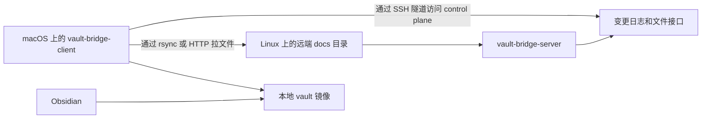

# vault-bridge

`vault-bridge` 是一个用 Go 实现的 C/S 文档同步工具，用来把远端文档树镜像到本地 vault。

英文版: [README.md](README.md)

## 项目概览

`vault-bridge` 解决的是一个很具体的工作流：文档保存在远端 Linux 机器上，同步到本地 macOS 的 vault，然后通过 Obsidian 浏览和检索。

当前项目范围：

- server 运行在 Linux
- client 运行在 macOS
- 同步方向为 server 到 client 的单向同步
- 内容类型是 markdown 和常见 vault 附件
- 部署方式优先简单可控，使用普通二进制和 shell wrapper

## 核心使用场景

典型流程：

1. docs 保存在远端 Linux 主机上
2. `vault-bridge-server` 监控远端 docs 目录
3. `vault-bridge-client` 把增量更新拉到本地目录
4. Obsidian 打开这个本地目录作为 vault

这样可以在不迁移 source of truth 的前提下，把远端 docs 以本地可读的方式打开。

## 工作方式



## 功能

- 增量事件日志和持久化 cursor
- server 端使用 `inotify` 加周期性全量 reconcile
- client 支持 one-shot 和长连接 stream 模式
- 文件传输优先使用 `rsync --files-from`
- `rsync` 不可用或失败时回退到 HTTP
- 当 server 端口不能直连时，client 可内置启动 SSH 隧道承载 HTTP control plane
- 通过 `config/filter.json` 配置过滤规则

## 仓库结构

- `cmd/vault-bridge-server/`: Linux server 入口
- `cmd/vault-bridge-client/`: macOS client 入口
- `internal/bridge/`: filter、journal store、reconcile、watcher
- `internal/protocol/`: 共享协议结构
- `config/`: 默认过滤配置
- `scripts/`: server/client 运行脚本
- `deploy/`: supervisor、`systemd`、launchd 示例
- `docs/`: 运维说明和环境相关指南

## 快速开始

构建：

```bash
go build ./...
```

在 Linux 主机上启动 server：

```bash
./bin/vault-bridge-server \
  -addr :39090 \
  -root /srv/vault-bridge/source \
  -state-dir "$HOME/.local/state/vault-bridge/server" \
  -filter-config ./config/filter.json
```

在 macOS 上以前台 stream 模式启动 client：

```bash
./bin/vault-bridge-client \
  -stream \
  -server http://127.0.0.1 \
  -tunnel-host server-host \
  -tunnel-remote-port 39090 \
  -local-root "$HOME/Documents/vault-bridge" \
  -state-dir "$HOME/Library/Application Support/vault-bridge" \
  -sync-mode auto \
  -rsync-source server-host:/srv/vault-bridge/source/ \
  -rsync-bin /opt/homebrew/bin/rsync
```

第一次同步完成后，在 Obsidian 里打开这个本地目录：

```text
$HOME/Documents/vault-bridge
```

## 如何配合 Obsidian 使用

client 跑起来以后，本地镜像目录就和普通 Obsidian vault 没区别。

推荐工作流：

1. 以前台 stream 模式运行 `vault-bridge-client`
2. 等待第一次同步结束
3. 在 Obsidian 中打开本地镜像目录
4. 阅读 docs 时保持 client 持续运行
5. 不需要实时更新时，用 `Ctrl+C` 停掉 client

如果你想简化命令，可以加一个 alias，把实际的 server host、vault 路径和 `rsync` 参数写进去。

## 配置

server 端过滤规则放在 `config/filter.json`。

默认行为和之前的 Python 实现一致：

- 排除 `.git/`
- 排除 `.obsidian/`
- 排除 `.DS_Store`
- 只包含 `.md`、`.png`、`.jpg`、`.jpeg`、`.gif`、`.webp`、`.svg`、`.pdf`、`.canvas`

传输模式：

- `auto`: 先尝试 `rsync`，失败时回退到 HTTP
- `rsync`: 强制要求 `rsync`
- `http`: 强制使用 HTTP 文件拉取

隧道参数：

- `-tunnel-host`: 用来暴露远端 server 端口的 SSH host
- `-tunnel-remote-host`: 从 SSH server 视角访问的远端目标 host；默认取 `-server` 的 host 部分
- `-tunnel-remote-port`: 远端目标端口；默认取 `-server` 的 port 部分
- `-tunnel-local-port`: 本地转发端口；`0` 表示自动挑一个大于 `30000` 的空闲端口
- server 默认监听端口：`39090`

## 部署

仓库内已经带了部署示例：

- Linux server: `deploy/supervisor/vault-bridge-server.conf`
- Linux user service: `deploy/systemd/user/vault-bridge-server.service`
- macOS client: `deploy/launchd/dev.vault-bridge.client.plist`

macOS 前台终端运行指南在这里：

- `docs/macos-foreground-client-guide.md`
