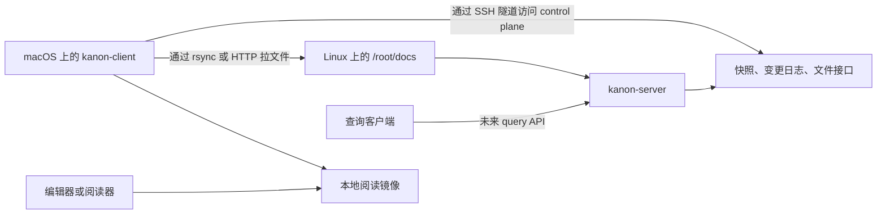

<div align="center">

# Kanon

> 为 `/root/docs` 建索引，并同步到本地阅读目录。

[](https://go.dev/)
[](#)
[](./LICENSE)

[English](./README.md) · [macOS 前台运行指南](./docs/macos-foreground-client-guide.md) · [Linux supervisord 部署指南](./docs/linux-supervisord-deploy-guide.md)

</div>

---

Kanon 是面向 `/root/docs` 的 Go client/server 系统。

当前职责：

- 监听 Linux docs 树
- 维护文件快照和追加式变更日志
- 提供 snapshot、changes、stream、文件传输接口
- 将变更文件同步到 macOS 本地阅读目录

计划职责：

- 为 `/root/docs` 建索引
- 查询时返回文档位置和定位信号

Kanon 不定义 `/root/docs` 应该如何书写或组织。

## 工作方式



## 组件

| 组件 | 作用 |
| --- | --- |
| `kanon-server` | 监听 `/root/docs`，维护文件快照和追加式事件日志，并暴露 HTTP 接口 |
| `kanon-client` | 拉取增量更新，维护本地 cursor，删除失效文件，拉取变更文件 |
| `rsync` | 变更文件的优先传输路径 |
| HTTP fallback | `rsync` 不可用或失败时的回退路径 |
| SSH tunnel | 当远端 HTTP 端口不能直连时，让 client 仍然能访问 control plane |

## 快速开始

构建：

```bash
go build ./...
```

在 Linux 主机上启动 server：

```bash
./bin/kanon-server \
  -addr :39090 \
  -root /root/docs \
  -state-dir "$HOME/.local/state/kanon/server" \
  -filter-config ./config/filter.json
```

在 macOS 上以前台 stream 模式启动 client：

```bash
./bin/kanon-client \
  -stream \
  -server http://127.0.0.1 \
  -tunnel-host server-host \
  -tunnel-remote-port 39090 \
  -local-root "$HOME/Documents/kanon" \
  -state-dir "$HOME/Library/Application Support/kanon" \
  -sync-mode auto \
  -rsync-source server-host:/root/docs/ \
  -rsync-bin /opt/homebrew/bin/rsync
```

第一次同步完成后，用任意本地阅读器或编辑器打开：

```text
$HOME/Documents/kanon
```

## 功能

- 增量事件日志和持久化 cursor
- server 端使用 `inotify` 加周期性全量 reconcile
- client 支持 one-shot 和长连接 stream 模式
- 文件传输优先使用 `rsync --files-from`
- `rsync` 不可用或失败时回退到 HTTP archive 传输
- client 内置 SSH 隧道支持 HTTP control plane
- 通过 `config/filter.json` 配置过滤规则

## 配置

server 端过滤规则放在 `config/filter.json`。

默认行为：

- 排除 `.git/`、`.obsidian/`、`.venv/`、`venv/`、`node_modules/`、`__pycache__/`、`.ruff_cache/`、`.mypy_cache/`、`.pytest_cache/`
- 排除 `.DS_Store`
- 排除 `*.log`、`*.tmp`、`*.swp`、`*.swo` 等 basename 文件模式
- 只包含 `.md`、`.png`、`.jpg`、`.jpeg`、`.gif`、`.webp`、`.svg`、`.pdf`、`.canvas`
- 可以通过 `excluded_path_patterns` 额外排除整棵路径子树或 glob 风格路径模式

传输模式：

| 模式 | 行为 |
| --- | --- |
| `auto` | 先尝试 `rsync`，失败时回退到 HTTP archive 传输 |
| `archive` | 强制使用 HTTP archive 传输 |
| `rsync` | 强制要求 `rsync` |
| `http` | 强制使用逐文件 HTTP 拉取 |

隧道参数：

- `-tunnel-host`: 用来暴露远端 server 端口的 SSH host
- `-tunnel-remote-host`: 从 SSH server 视角访问的远端目标 host；默认取 `-server` 的 host 部分
- `-tunnel-remote-port`: 远端目标端口；默认取 `-server` 的 port 部分
- `-tunnel-local-port`: 本地转发端口；`0` 表示自动挑一个大于 `30000` 的空闲端口
- server 默认监听端口：`39090`

## 仓库结构

- `cmd/kanon-server/`: Linux server 入口
- `cmd/kanon-client/`: macOS client 入口
- `internal/core/`: filter、journal store、reconcile、watcher
- `internal/protocol/`: 共享协议结构
- `config/`: 默认过滤配置
- `scripts/`: server/client 运行脚本
- `deploy/`: supervisor、`systemd`、launchd 示例
- `docs/`: 运维说明和环境相关指南

## 部署文件

- Linux server: `deploy/supervisor/kanon-server.conf`
- Linux user service: `deploy/systemd/user/kanon-server.service`
- macOS client: `deploy/launchd/dev.kanon.client.plist`

如果 Linux 主机上的 `kanon-server` 由 `supervisord` 托管，见：

- `docs/linux-supervisord-deploy-guide.md`

如果你是在 macOS 终端前台运行，见：

- `docs/macos-foreground-client-guide.md`
